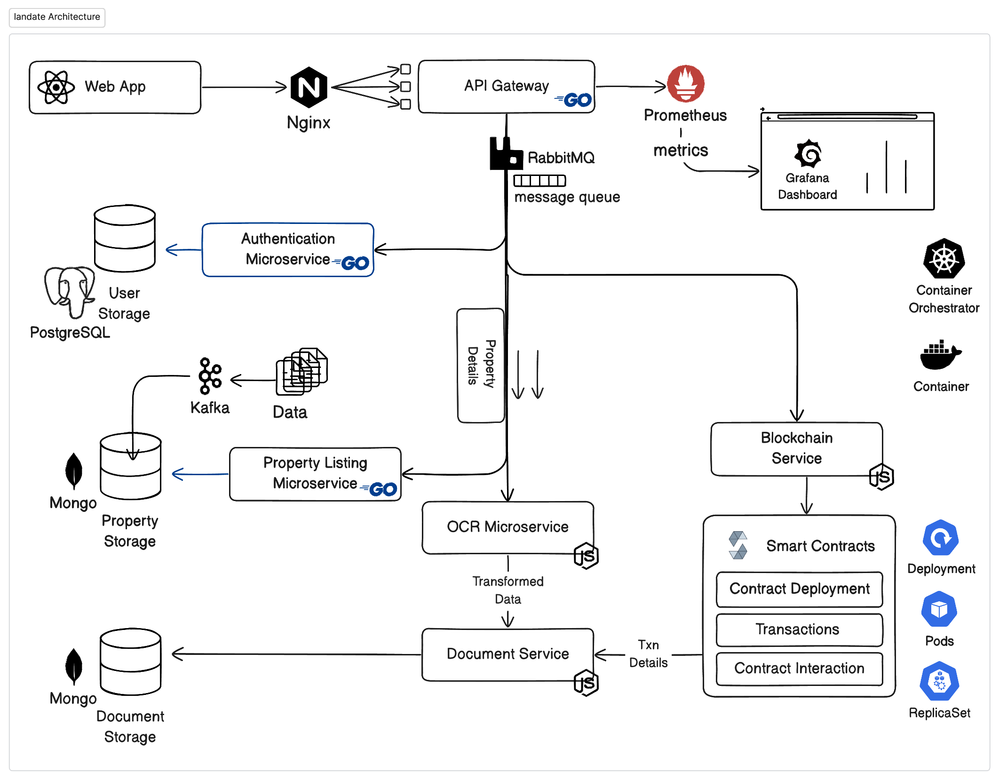
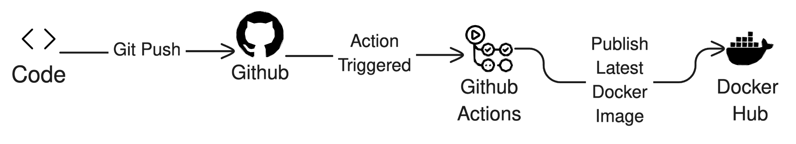

<h1 align="center">Landate</h1>


<p align="center">
The lack of secure property rights in India is a significant problem, particularly for the urban poor. Disputes over land ownership slow down real estate transactions, and those without official documents face barriers to accessing financial and government services. Our Application is created to facilitate discussions between individuals and government officials to update land records and establish ownership. We provide education on property rights and offer resources for obtaining legal assistance. By addressing these issues, the project would help promote greater security and stability in property ownership in India.
</p>

--- 

[](https://circleci.com/gh/The-Origin-Labs/landate)
[](https://GitHub.com/The-Origin-Labs/landate.js/graphs/commit-activity)[](http://shields.io/)
## ⚒️ Tech Stack

- `Go`
- `GoFiber` 
- `Consul` - Service Discovery
- `Prometheus` - Monitoring and Alerting
- `Grafana` - Metric Visualization
- `Jaeger` - E2E distributed Tracing for our microservices.
- `RabbitMQ` - Message Broker _Integration Under Process_
- Check the 👉 [Api Documenation](https://landate-api.apidog.io/)

> _client side for the application is present in 
    [repository](https://polysite) 
    [website](https://landate.vercel.app/)_

## Architecture


### Github Actions



## App features


### 👌Features

- Transaction monitoring between services
- Service dependency Analysis
- Service Discovery and Failure Monitoring
### ⚡ Performance


## Environment Variables

To run this project, you will need to add the following environment variables to your `.env` file

```bash
# API KEY
API_ACCESS_KEY=

# API GATEWAY CONFIGURATION
API_GATEWAY_PORT="8000"

# STORAGE SERVICE CONFIGURATION
STORAGE_SERVICE_PORT="8001"

# AUTHENTICATION SERVICE CONFIGURATION
AUTH_SERVICE_PORT="8002"

# DOCUMENT SERVICE CONFIGURATION
DOCUMENT_SERVICE_PORT="8003"
MONGO_URI=mongodb://<dbuser>:<password>@db:27017

# OCR SERVICE CONFIGURATION
OCR_SERVICE_PORT="8004"

# BLOCKCHAIN SERVICE CONFIGURATION
BLOCKCHAIN_SERVICE_PORT="8009"

# NOTIFICATION SERVICE CONFIGURATIONS
SNS_SERVICE_PORT="8005"
AWS_BUCKET=
AWS_KEY=
AWS_TIMEOUT=


# DATABASE CONFIGURATIONS
POSTGRES_URI=postgresql://<username>:<password>@postgres:5432/<dbname>?sslmode=disable
DB_HOST=localhost
DB_PORT=5432
DB_USER=<username>
DB_PASSWORD=<password>
DB_NAME=<dbname>
```

DATABASE CONFIGURATIONS

- `POSTGRES_URI`=`postgresql://<username>:<dbpass>@postgres:5432/<dbname>?sslmode=disable`
- `DB_HOST`=`localhost`
- `DB_PORT`=`5432`
- `DB_USER`=`username`
- `DB_PASSWORD`=`<dbpass>`
- `DB_NAME`=`dbname`

## Setting up development environment

**To Start all the Container Services**
- Make sure that you have Terraform installed.
```shell
cd .terraform
terraform init && terraform apply 
```
This command creates and starts containers for each service in docker compose format

> _Note: The Application endpoint may not be accessible due to authorization restriction._

```shell
go mod download
go run main.go
```

## Running the Application Server using Docker

```bash
docker-compose -f docker-compose.prod.yaml --project-name landate up -d
```

- For Stopping and Removing Application Server

```bash
docker-compose -f docker-compose.prod.yaml --project-name landate down
```


### Setting Up a RabbitMQ (Message Broker) Instance Locally

This command starts a RabbitMQ container named "rabbitmq" with the hostname "my-rabbit". The container's management interface is accessible on port 15672 of the host machine, while the AMQP port is accessible on port 5672.

```shell
docker run -d --hostname my-rabbit --name rabbitmq -p 15672:15672 -p 5672:5672 rabbitmq:3-management
# or
docker-compose up rabbitmq
```

### Setting Nginx Deployment

**Create a new nginx deployment**:
- Make sure that you have Minikube installed on your system. If you already have Docker installed, you can use Minikube directly from Docker. Otherwise, you can refer to the official documentation website's Minikube guide for instructions on how to set it up.

```shell
minikube start # To start minikube cluster
```

```shell
cd .kubernetes 
# To apply Nginx deployment. --replicas=3
kubectl apply -f nginx-deployment.yaml 
```

**To Create Stateful MongoDB**

- To achieve a stateful MongoDB deployment, you can utilize a StatefulSet in Kubernetes. With this approach, each replica of MongoDB will be associated with its dedicated persistent volume. Additionally, to optimize query performance, each of these pods will be indexed.

```yaml
apiVersion: apps/v1
kind: StatefulSet
metadata:
  name: mongodb
spec:
  selector:
    matchLabels:
      app: mongodb
  serviceName: mongodb
  replicas: 3 # <--- No. of replicas
  template:
    metadata:
      labels:
        app: mongodb
        .
        .
        .
        .
    volumeClaimTemplates:
    - metadata:
        # 👇 Persistent Volume Claim for each pod
        name: mongodb-persistent-data 
      spec:
        .
        .
        .
```

**Create MongoDB Service**

```shell
# To mongodb service
kubectl apply -f mongodb-svc.yaml 
```

This will create a service named `mongodb` that will be responsible for exposing the MongoDB deployment to other pods within the cluster.

**MongoDB StatefulSet**

```shell
# To Create MongoDB statefulset in K8s
kubectl apply -f mongo-statefulset.yaml 
```
This will create a statefulset named `mongodb` with 3 replicas. Each replica will have a dedicated persistent volume for storing MongoDB data. The statefulset will use the service named `mongodb` to provide connectivity to the MongoDB pods.

---

## Author
[Siddhant Prateek](https://github.com/siddhantprateek)
