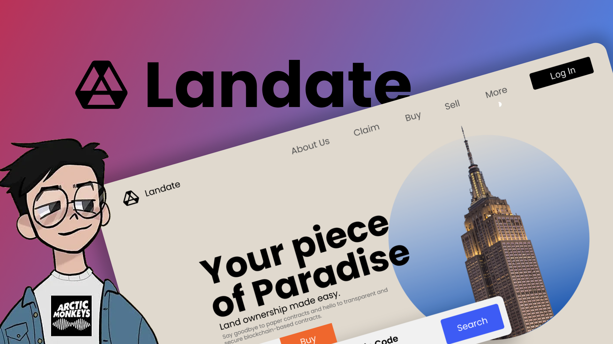

<h1 align="center">Landate</h1>

The lack of secure property rights in India is a significant problem, particularly for the urban poor. Disputes over land ownership slow down real estate transactions, and those without official documents face barriers to accessing financial and government services. Our Application is created to facilitate discussions between individuals and government officials to update land records and establish ownership. We provide education on property rights and offer resources for obtaining legal assistance. By addressing these issues, the project would help promote greater security and stability in property ownership in India.

## ⚒️ Tech Stack

- `Go`
- `GoFiber` 
- `Consul` - Service Discovery
- `Prometheus` - Monitoring and Alerting
- `Grafana` - Metric Visualization
- `Jaeger` - E2E distributed Tracing for our microservices.

- Check the 👉 [Api Documenation](https://landate-api.apidog.io/)

> _client side for the application is present in 
    [repository](https://polysite) 
    [website](https://landate.vercel.app/)_

## Architecture

## App features

### 👌Features

- 
- 
- 
### ⚡Performance

- 
- 
-

## Environment Variables

To run this project, you will need to add the following environment variables to your `.env` file

- `API_GATEWAY_PORT`=`"8000"`
- `STORAGE_SERVICE_PORT`=`"8001"`
- `AUTH_SERVICE_PORT`=`"8002"`
- `DOCUMENT_SERVICE_PORT`=`"8003"`
- `OCR_SERVICE_PORT`=`"8004"`

DATABASE CONFIGURATIONS

- `DB_HOST`=`localhost`
- `DB_PORT`=`5432`
- `DB_USER`=`postgres`
- `DB_PASSWORD`=`<heimdalkeptsecret>`
- `DB_NAME`=`heimdb`

## Author
[Siddhant Prateek](https://github.com/siddhantprateek)
